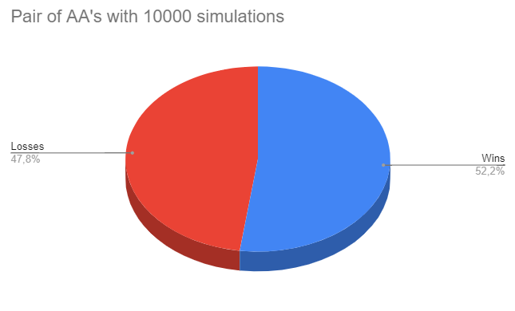
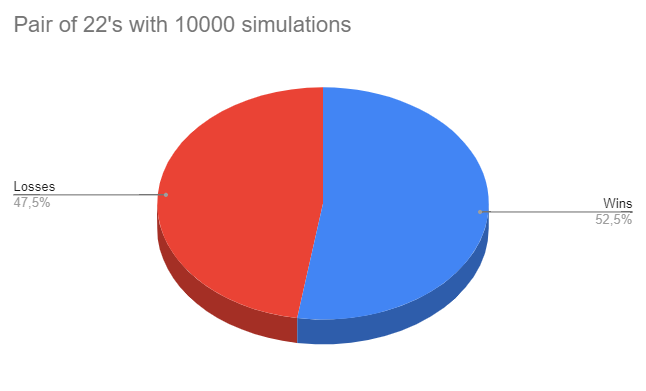
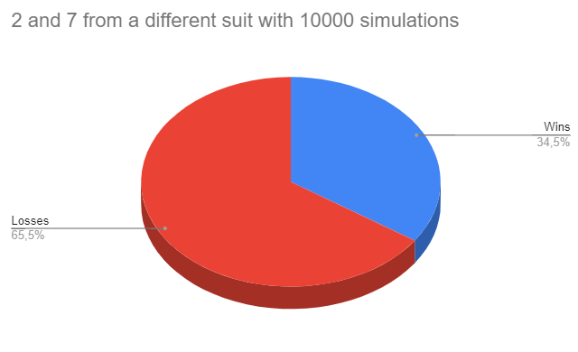

# CI-0130-2022-S1 | Laboratory 4

This project was developed by:

**B82957** | Marco Ferraro Rodriguez  
**B71146** | Gabriel Bogantes Armijo

When the test cases are run the following results come up:

- <u>A Pair of AA's</u>: 
    
<b>Wins %:</b> 52.2

    
<b>Losses %:</b> 47.8

    
- <u>A Pair of 22's</u>: 
    
<b>Wins %:</b> 52.54

    
<b>Losses %:</b> 47.59

    
- <u>2 and 7 from a different suit</u>:
    
<b>Wins %:</b> 34.49
    
    
<b>Losses %:</b> 65.51

    
